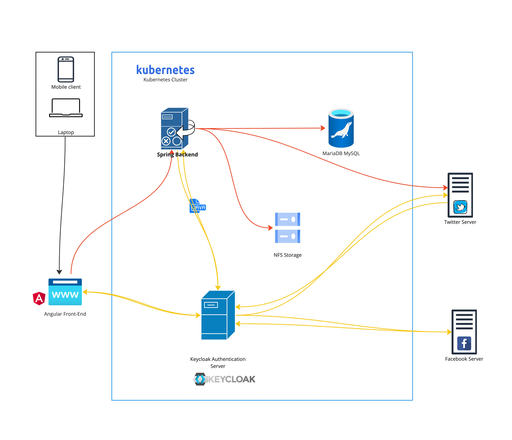
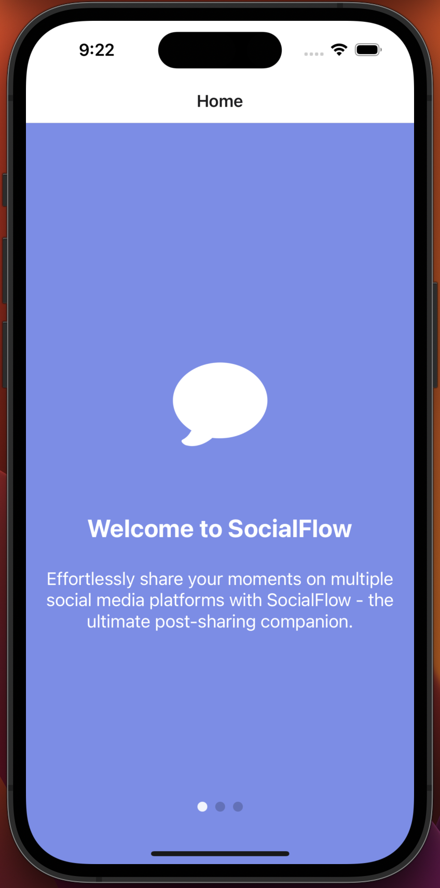
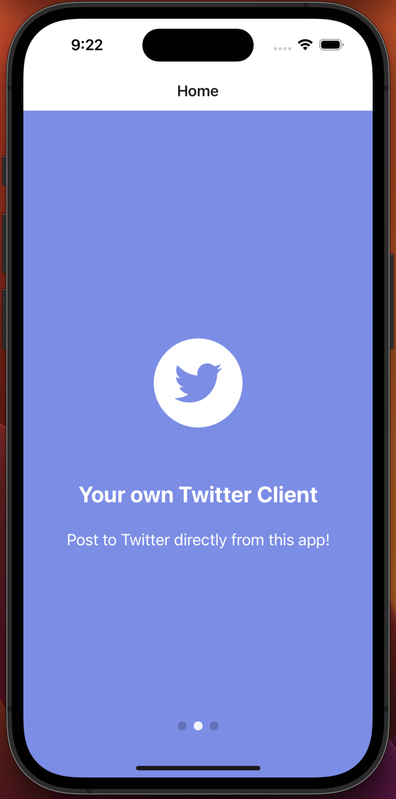
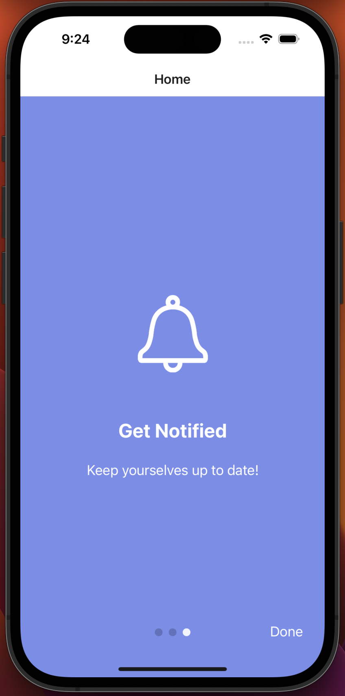
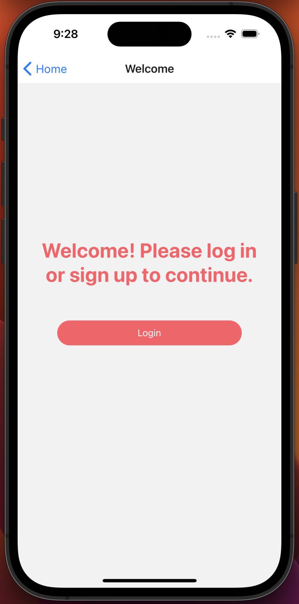
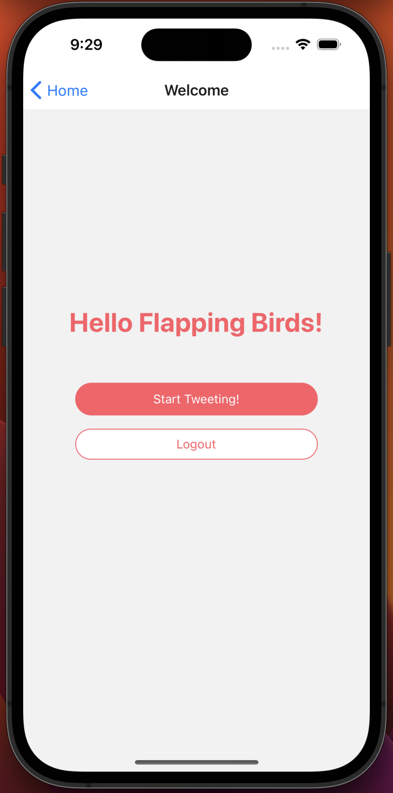
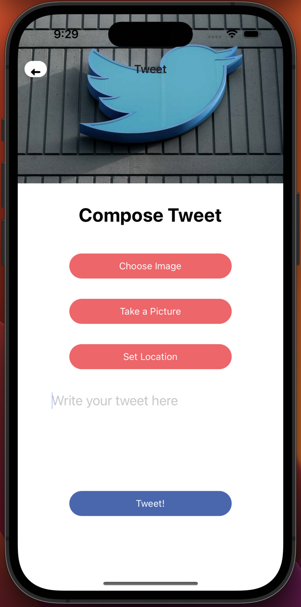
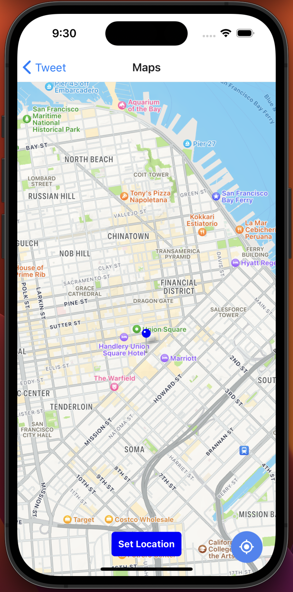
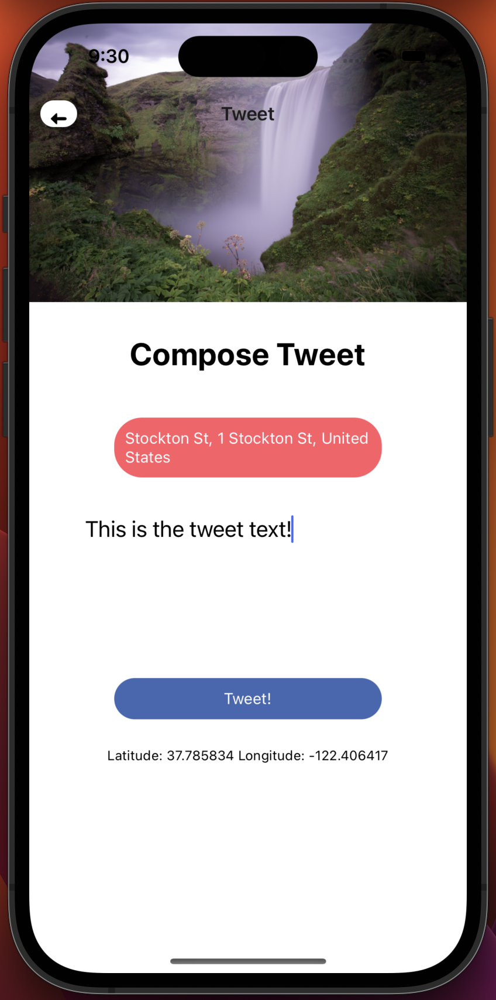
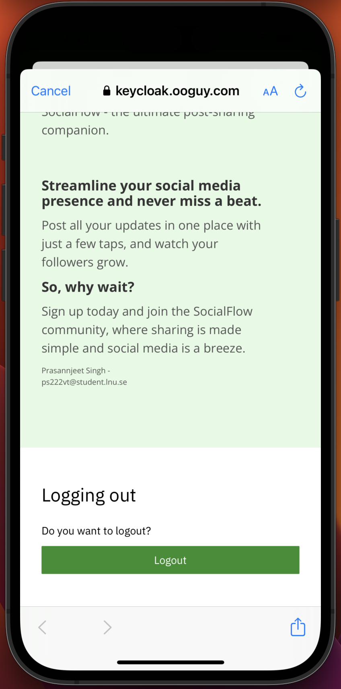

# SocialFlow
The project was initially done as an assignment

[Watch the demo here](resources/demo.mov)

[Watch the app demo here](https://www.loom.com/share/f6a484ae1fa64163b147a45409fdc962)

SocialFlow is a mobile application that allows users to share and upload their pictures on a social media website. The application has a user-friendly interface and provides a seamless experience for users to log in and post their pictures. With SocialFlow, users have the ability to connect their Facebook and Twitter accounts to the platform, enabling them to authenticate themselves via OAuth and post pictures on their behalf.

## Table of Contents

- [SocialFlow](#socialflow)
  - [Table of Contents](#table-of-contents)
  - [Architecture Diagram](#architecture-diagram)
  - [Technology Selection](#technology-selection)
  - [Deployment Process](#deployment-process)
  - [Angular Front-End](#angular-front-end)
  - [Spring Framework Back-End](#spring-framework-back-end)
- [Mobile Application Development with React Native](#mobile-application-development-with-react-native)
  - [Native Features Access](#native-features-access)
  - [Development Environment](#development-environment)
  - [GUI Design](#gui-design)
    - [Screenshots:](#screenshots)
      - [Initial Walkthrough](#initial-walkthrough)
      - [Login and further](#login-and-further)
      - [Maps and Logout](#maps-and-logout)
  - [Implementation Requirements](#implementation-requirements)
  - [Other Notable Implementations](#other-notable-implementations)
- [Queries](#queries)

## Architecture Diagram



## Technology Selection

The selected technologies for this web and mobile application have been chosen to provide a robust, scalable, and secure solution for uploading pictures to a social media website.

- **Front-end**: Angular
- **Back-end**: Spring Boot
- **Database management system**: MariaDB
- **Authentication server**: Keycloak
- **Storage solution**: NFS Storage Server
- **Hosting**: Kubernetes cluster

## Deployment Process

All the individual apps were deployed using Docker images. Thus, the initial process is to create a docker image for them, followed by setting appropriate environment variables for it to run properly.

Deployment to Kubernetes consists of the following steps, and depending upon the apps and their requirements, some of the steps might be omitted.

1. Create a volume for shared data, if the container needs a persistent volume.
2. Add any free SSL Certificates, if required.
3. Configure environment variables, like the database location, api keys, etc. for the microservice.
4. Create a file called as deployment.yaml for kubernetes, this file is almost like the docker-compose.yml in docker.
5. Create another configuration file called as service in kubernetes.
6. Create a final configuration called as the Traefik IngressRoute, which is eventually responsible to assign a domain to this microservice, and ensure that SSL certificates if any needs to be updated to fetched is done.

## Angular Front-End

The project is based on Angular 12, and has a file called package.json with all the relevant information about the scripts. The first step is to create a Dockerfile that will contain all the build information for this app.

```dockerfile
FROM node:14.20.0-alpine AS build  
WORKDIR /app  
COPY package.json /app  
RUN npm install  
COPY . /app  
RUN npm run build --prod  
  
FROM nginx:1.17.10-alpine  
COPY --from=build /app/dist/angular-front /usr/share/nginx/html  
COPY default.conf /etc/nginx/conf.d/default.conf  
EXPOSE 80  
CMD ["nginx", "-g", "daemon off;"]
```

## Spring Framework Back-End

The spring microservice was made in Java with JDK version 17. For building the project, a tool called Maven was used, which is

similar to package.json in node.js. Here, first the project needs to be built, which can be done by:

```bash
mvn clean install
```

After this, the Dockerfile is found in the target folder. So the following command is run to build the image:

```bash
docker build -t prasannjeet/socialflow-service:1.0.0-SNAPSHOT .
```

The Dockerfile in this case looks like:

```dockerfile
FROM prasannjeet/timetable-base:1.0.0  
  
ENV JAVA_MAX_MEM=1024m \  
    JAVA_MAX_PERM_MEM=128m \  
    SERVICE_8080_NAME=socialflow-service \  
    TZ=Europe/Stockholm  
  
COPY application.yml ${APP_FOLDER}/  
COPY socialflow-service-1.0.0-SNAPSHOT.jar ${APP_FOLDER}/app.jar  
  
# Path to upload images. Update Env Variable too.  
RUN mkdir /media/uploads/  
  
ENTRYPOINT ["java", "-Djava.security.egd=file:/dev/./urandom", "-agentlib:jdwp=transport=dt_socket,server=y,suspend=n,address=*:5005", "-jar", "app.jar"]  
  
EXPOSE 8080 8443 5005
```

Here, we create a folder with the destination /media/uploads. This is where we will store the images later. Following the building of image, this image also needs to be pushed to the docker-hub using the same command. Once this image is available at the docker hub, we can then use its image id and deploy it in the Kubernetes cluster.

# Mobile Application Development with React Native

[Watch the demo here](resources/demo.mov)

This document outlines the process of developing a mobile application using the React Native framework. The application was developed as part of an assignment and includes features such as user authentication, location services, and image capture.

## Native Features Access

React Native provides access to native features of the device, such as GPS and Camera. However, it's worth noting that the performance of a React Native app may not be as good as a native app since React Native relies on a bridge to communicate with the native components of the device.

## Development Environment

The development environment consisted of various IDEs for local development. [WebStorm](https://www.jetbrains.com/webstorm/) was used for React Native development, [DataGrip](https://www.jetbrains.com/datagrip/) for browsing and viewing SQL Tables, and [JetBrains IntelliJ Idea](https://www.jetbrains.com/idea/) for backend Java development. Docker, Kubernetes, and other tools were also used as part of the development environment.

## GUI Design

The GUI design was primarily done using the React Native UI Library. An online free template from Instamobile was also used to add the initial walkthrough page to improve the appearance. Other UI screens were designed as per the requirements of the application.

### Screenshots:

#### Initial Walkthrough

| | | |
|:-------------------------:|:-------------------------:|:-------------------------:|
||||

#### Login and further

| | | |
|:-------------------------:|:-------------------------:|:-------------------------:|
||||

#### Maps and Logout

| | | |
|:-------------------------:|:-------------------------:|:-------------------------:|
||||

## Implementation Requirements

The application was developed with the following requirements:

1. Users should be able to locate themselves on Google Maps.
2. Users should be able to access a phone camera, create a picture/video, and upload it to a particular social media account, including the location.
3. Users should be able to save the created picture together with user notes and location data in local storage.

All of the above requirements were successfully implemented.

## Other Notable Implementations

Apart from the main requirements, the application also includes the following features:

- User Authentication: Users can log in to the app and also have an option to create a username and password login.
- Location: Users can drag and drop the pin to select a location, click on the map to change their location, and once the location is chosen, the textual address is shown in the front-end.
- Image: Users can choose to pick an image from their gallery, crop the image before posting, and view the tweet by pressing a button immediately after sending the tweet.

# Queries
Any questions can be directed to `8prasannjeet` `at` `gmail`.